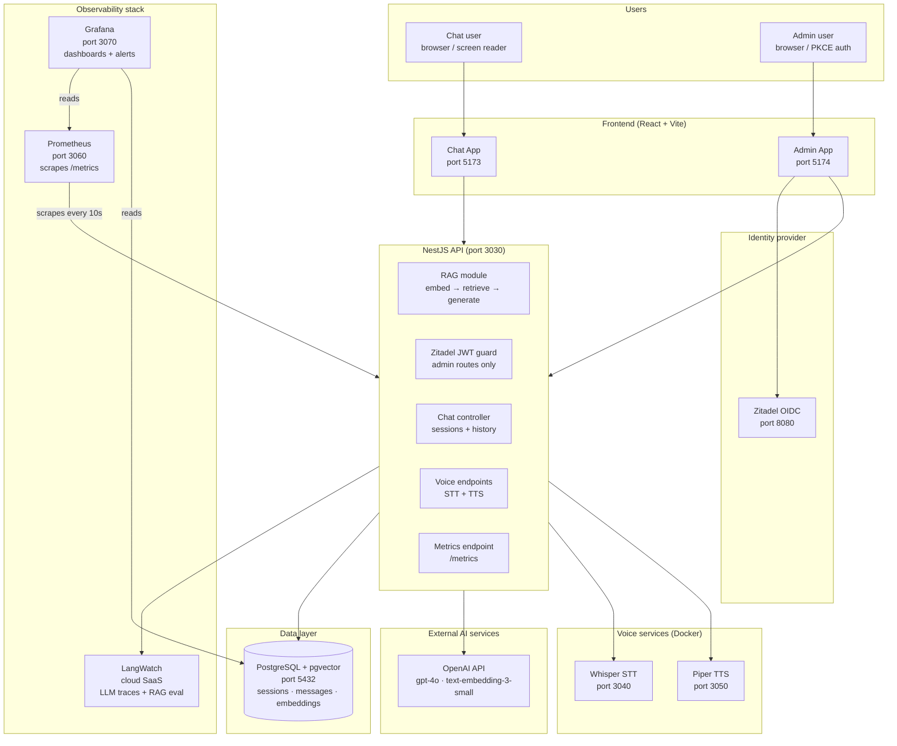
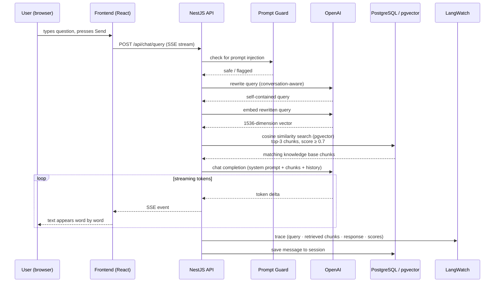
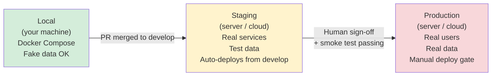
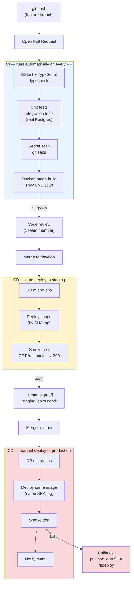
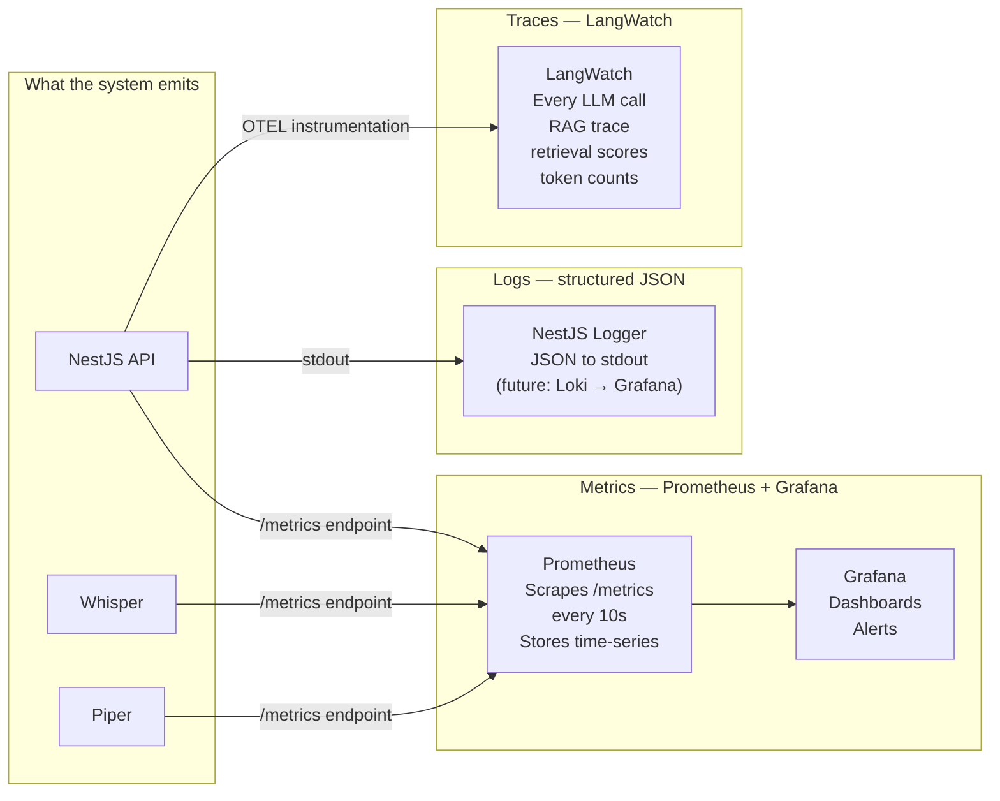
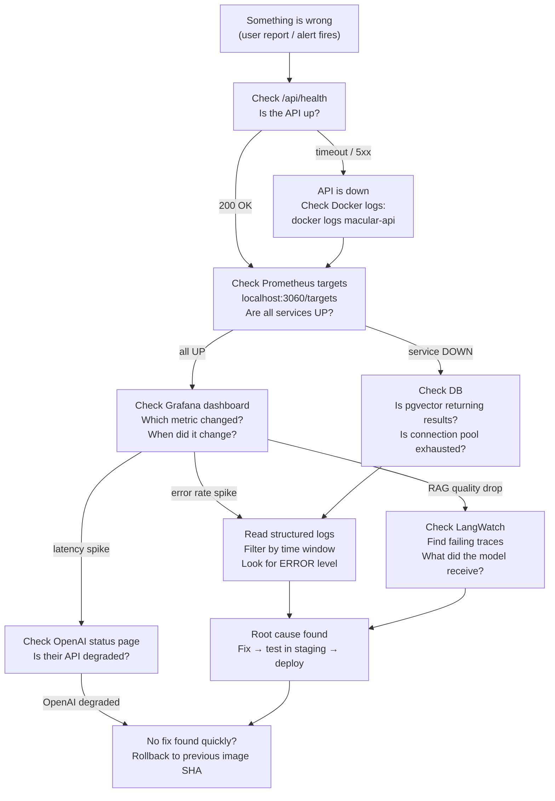

# What It Takes to Run Software in Production

> A conversation guide for junior developers — using the Macular Society RAG Platform as a worked example.

This document is structured as a walkthrough. Each section builds on the last. Use it as talking notes when explaining production concepts to someone who can write code but has never shipped or operated a live system.

---

## The core mental model shift

When you write code locally, you have full visibility. You run the program, you watch it, you see errors immediately, you restart it. Your feedback loop is seconds.

Production is different in almost every way:

| Local development | Production |
|---|---|
| You run it | Users run it — constantly, at any time |
| You see errors immediately | Errors surface minutes or hours later in logs |
| You can attach a debugger | You can only read what the system chose to record |
| One environment | Multiple environments (staging, prod) |
| One user (you) | Many concurrent users |
| Restarts are instant | Restarts must be zero-downtime |
| Secrets in `.env.local` | Secrets in a vault or CI secrets store |
| Failure affects only you | Failure affects real people |

**The job in production is not to write correct code. It is to build a system that tells you when it is wrong — before users do.**

---

## 1. What the system actually is

This is not a single program. It is a set of services that talk to each other. Each one has a job. All of them must be running for the product to work.



**Key point to make:** Every box in this diagram is a separate process. If Postgres goes down, the API cannot answer questions. If OpenAI is unreachable, the RAG pipeline fails. If Whisper crashes, voice input breaks but chat still works. Understanding *which component failed* is the first step in debugging anything.

---

## 2. How a single request travels through the system

When a user types a question, this is what happens before they see an answer:



**Key points to make:**
- The user sees text appearing word by word because of **Server-Sent Events (SSE)** — the API does not wait for the full answer before sending anything.
- Every OpenAI call costs money and takes time. If it slows down, the user waits. Metrics track this.
- LangWatch records every trace so you can go back and inspect what the model saw, what it retrieved, and what it said. This is your debugger for AI behaviour.
- If retrieved chunks score below 0.7 cosine similarity, the model gets no context and must decline to answer. This threshold is intentional — it prevents hallucination.

---

## 3. Environments: local → staging → production

You never deploy untested code directly to production. There is always a progression.



**Why three environments?**

- **Local**: fast feedback. Break things freely.
- **Staging**: mirrors production as closely as possible. Catch configuration bugs, integration bugs, and migration issues before they affect users.
- **Production**: users are here. Every change must be tested in staging first.

**Key rule:** The Docker image that passed tests and ran in staging is the *exact same image* deployed to production. You never rebuild at deploy time.

---

## 4. How code gets from your laptop to production (CI/CD)

CI/CD stands for Continuous Integration / Continuous Deployment. It is the automated pipeline that turns a `git push` into a running service.



**Key points to make:**
- A test that passes on your laptop must also pass in CI. CI is an independent machine with no special setup — it proves the code works cold.
- The "same SHA tag" rule: Docker images are tagged by git commit SHA (e.g. `sha-abc1234`). You deploy that exact tag to staging, sign off on it, and deploy *that same tag* to production. No surprises.
- Rollback means: pull the previous working image tag and redeploy it. You can do this in minutes. **This is why you keep the last 3 releases tagged in the registry.**
- Database migrations are the scariest part of a deploy. Prefer additive changes (add columns, never drop them in the same release). A bad migration can corrupt data that you cannot easily recover.

---

## 5. Configuration and secrets

In production, configuration is environment-specific. Secrets (API keys, passwords) must never appear in code or git history.

**This project's pattern:**

| File | What goes in it | Committed? |
|---|---|---|
| `.env.config` | Non-secret config (ports, feature flags, model names) | Yes |
| `.env.secrets` | API keys, DB passwords, LangWatch token | No — gitignored |
| CI secrets store | Same secrets, injected at build/deploy time | Via GitHub Actions secrets |

**Why does this matter in production?**

If a developer commits an OpenAI API key to git — even for a second, even to a private repo — it should be treated as compromised. Bots scan GitHub continuously. The key must be rotated immediately.

The `.env.secrets` file is gitignored precisely to prevent this. In production, secrets are injected by the deployment system, not stored in files.

**This project uses Zitadel** as the identity provider for admin access. JWT tokens are issued by Zitadel, validated by the API on every admin request. The API never stores passwords — it only validates signatures.

---

## 6. Observability: how you see what the system is doing

In production, you cannot attach a debugger or add `console.log` and redeploy. The system must produce its own record of what happened. This is observability. It has three pillars:



### Metrics (the numbers)

Prometheus scrapes a `/metrics` endpoint every 10 seconds and stores time-series data. Grafana reads it and draws graphs. This is how you answer questions like:

- How many RAG queries per minute?
- What is the p95 latency for a response?
- How much are we spending on OpenAI tokens today?
- Are there more errors than usual?

**Key metrics in this project:**

| What you're watching | Metric name | Normal |
|---|---|---|
| RAG queries | `macular_rag_queries_total` | Steady rate |
| Retrieval quality | `macular_rag_retrieval_score` | > 0.7 average |
| Response latency | `macular_openai_api_duration_seconds` | < 3s p95 |
| Token spend | `macular_estimated_cost_usd` | Below daily budget |
| Voice STT latency | `macular_whisper_transcription_duration_seconds` | < 2s p95 |

### Logs (the narrative)

Logs are the written record of what happened. When a metric goes wrong, you read logs to understand why. Good logs are structured (JSON), include a request ID so you can trace one user's journey, and **never include personal data** (GDPR).

### Traces (the AI-specific layer)

LangWatch records every LLM interaction: what query was sent, what chunks were retrieved, what the model responded, how many tokens it used, and quality scores. This is your debugger for AI behaviour — the equivalent of a stack trace for machine learning.

---

## 7. Debugging in production

When something is wrong, you follow evidence. You do not guess.



**The mental model:** Work from the outside in. Is the API reachable? Are its dependencies reachable? What do the numbers show? What do the logs say? What did the AI actually receive and generate?

**Practical debugging commands for this stack:**

```bash
# Is the API up?
curl http://localhost:3030/api/health

# API logs (live tail)
docker logs -f macular-api

# Which services are healthy?
make docker-status

# Prometheus — are all targets being scraped?
# open http://localhost:3060/targets

# Grafana — what changed in the last hour?
# open http://localhost:3070

# Database — can we connect?
psql $DATABASE_URL -c "SELECT 1"
```

---

## 8. Security in production

Security is not a feature you add at the end. It is a set of properties the system must maintain continuously.

**For this project, the critical ones are:**

| Concern | What we do | Why |
|---|---|---|
| Prompt injection | PromptGuard sidecar checks every query | Users could try to hijack the AI's behaviour |
| Auth | Zitadel OIDC + JWT validation on admin routes | Admin actions must be authenticated |
| Rate limiting | IP-level + per-session limits | Prevents cost attacks; single user can't exhaust OpenAI budget |
| Secrets | `.env.secrets` gitignored; CI secrets store | Leaked keys = compromised external services |
| Input validation | TypeBox on all request DTOs | Malformed input crashes or misbehaves |
| Query length cap | 1500 characters max | Limits token spend and attack surface |
| No PII in logs | Structured logging with redaction | GDPR requirement |
| CORS locked | Only production origin allowed | Prevents cross-origin abuse |

**Secret scanning is part of CI.** gitleaks runs on every push. If a secret is detected, the build fails and the developer must rotate the key before merging.

---

## 9. What "healthy" looks like in Grafana

The first time you open Grafana in production, it is overwhelming. Here is what to look at.

**Normal state:**
- RAG query rate: steady line, some variation by time of day
- Retrieval score: mostly above 0.7 — if it drops consistently, the knowledge base may need re-embedding or the query rewrite is failing
- API error rate: near zero — any sustained non-zero means something is broken
- Token spend: gradual accumulation — a sudden spike means unusual traffic or a bug causing repeated calls
- Whisper / Piper latency: below 2s p95 — above that, voice users experience noticeable lag

**The question Grafana answers is not "is there a problem?" — it is "when did the problem start and what changed at that moment?"** If you see a metric spike at 14:32, you look at what was deployed or changed at 14:30.

---

## 10. Incident response: when things go seriously wrong

An incident is when production is broken and users are affected. The steps are always the same:

1. **Detect** — an alert fires (Grafana / uptime monitor) or a user reports it
2. **Assess** — how bad is it? All users? Some? One feature?
3. **Communicate** — tell the team immediately, even if you don't know the cause yet
4. **Contain** — if you can roll back, do it. Restore service first, investigate second
5. **Investigate** — use logs, metrics, traces to find the root cause
6. **Fix** — deploy the fix through staging, then to production
7. **Post-mortem** — write down what happened, why, and what changes prevent recurrence

**Rolling back in this project:**
```bash
# Re-deploy the previous working image SHA
docker pull ghcr.io/macular-society/api:sha-<previous>
docker compose up -d
```

**The golden rule:** Never try to fix a live production incident by deploying an untested change. Rolling back is almost always safer and faster than pushing a hotfix blind.

---

## 11. The charity-specific context: why accessibility is a production concern

This system serves people with macular degeneration — a condition causing progressive central vision loss. Many users rely on:
- Screen readers (e.g. JAWS, NVDA, VoiceOver)
- Keyboard-only navigation
- Enlarged text
- Voice input and output (Whisper STT, Piper TTS)

**Why this matters for production operations:**

A change that breaks `aria-label` attributes on a button, or that removes a `role="log"` from the chat message list, is invisible in normal testing but breaks the product completely for screen reader users. These users are the primary audience. An accessibility regression is a production incident.

Before any frontend release:
- Run the accessibility audit (`/audit-a11y`)
- Test keyboard navigation end-to-end
- Check that voice input/output still works

The voice pipeline is a separate chain of services (Whisper + Piper + API) — a latency spike anywhere in that chain degrades usability for users who depend on voice because they cannot read small text comfortably.

---

## Summary: the activities of a production engineer

| Activity | What it means in practice | Tools |
|---|---|---|
| Deploy | Ship code safely through environments with a gate | GitHub Actions, Docker, git tags |
| Monitor | Watch the numbers and know what normal looks like | Grafana, Prometheus |
| Observe traces | Understand what the AI did on any given request | LangWatch |
| Debug | Follow evidence from symptom to root cause | Logs, metrics, traces, health endpoints |
| Rollback | Restore the previous working version fast | Docker image SHA tags |
| Secure | Keep secrets safe, scan for vulnerabilities, validate input | gitleaks, Trivy, Zitadel, rate limits |
| Maintain | Database migrations, dependency updates, prompt changes | Drizzle, Dependabot, LangWatch evals |
| Respond to incidents | Detect, contain, fix, learn | Alerting, runbooks, post-mortems |

Production engineering is not glamorous. Most of the work is watching dashboards, writing runbooks, and making deployments boring and predictable. A good week in production is when nothing happens.

---

*Diagrams use [Mermaid](https://mermaid.live) — paste any code block there to view or edit interactively.*
