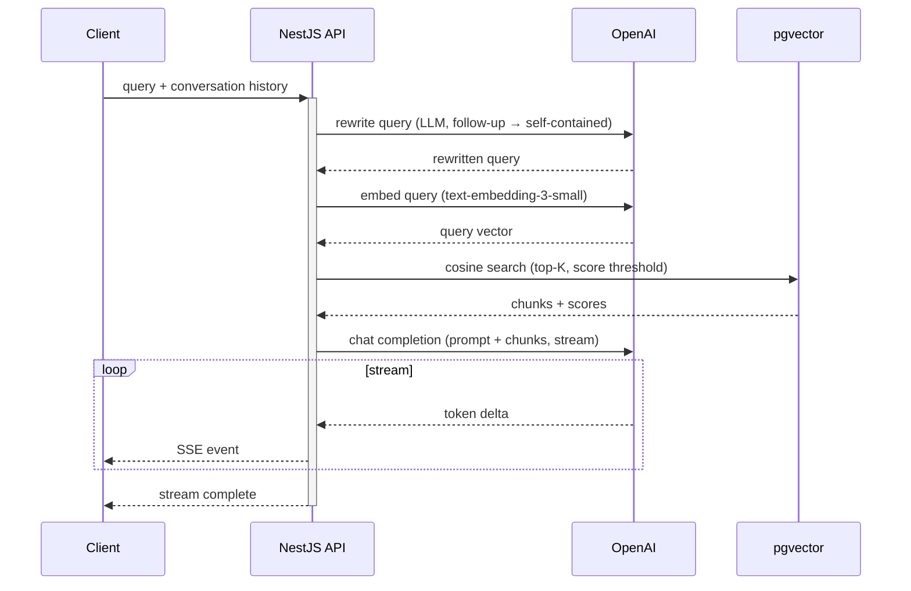

# RAG query — request/response sequence

> Source: docs/adr/009-rag-pipeline.md, projects/api/src/modules/rag/rag.service.ts | Type: sequenceDiagram | Date: 2026-03-08
> Edit online: paste the code block below into https://mermaid.live

## Single RAG query: from user message to streamed answer

## Notes

- **Query rewrite** uses the last N conversation turns (e.g. `RAG_CONTEXT_HISTORY_MESSAGES`); if the question is already self-contained, it is returned unchanged.
- **Retrieval** uses top-3 chunks and a cosine similarity threshold (0.5 in ADR; configurable, e.g. 0.7 in production).
- Tool calls (e.g. contact collection) and observability (traces, retrieval logging) are omitted; add a second sequence or swimlane for tool-call loops if needed.
