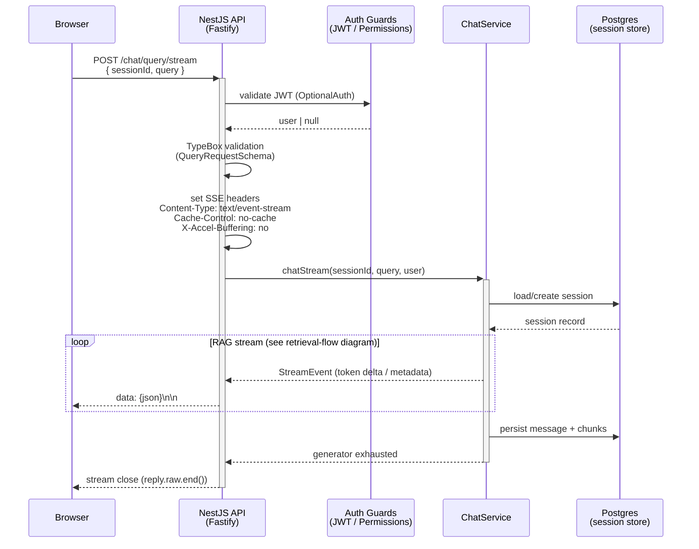
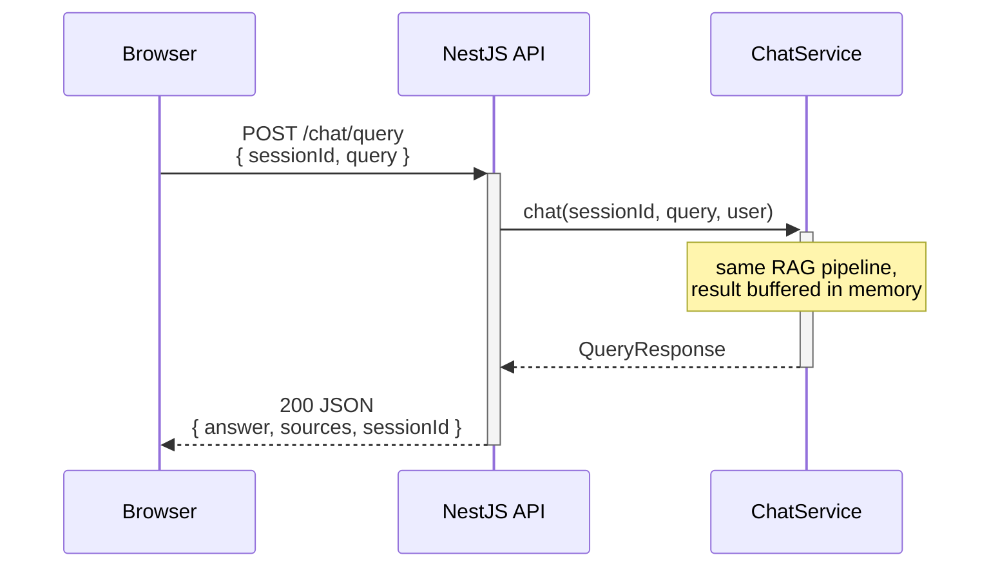

# Request flow

> Source: projects/api/src/modules/chat/chat.controller.ts | Type: sequenceDiagram | Date: 2026-06-02
> Edit online: paste the code block below into https://mermaid.live

## HTTP request lifecycle — from browser to streamed SSE response

## Non-streaming path (`POST /chat/query`)

## Notes

- **OptionalAuth** — the stream endpoint accepts anonymous requests; `user` may be `null`. Session ownership is still enforced for authenticated users on `GET /sessions/:id`.
- **SSE framing** — each event is written as `data: <json>\n\n`. The frontend reads via `fetch` + `ReadableStream`; no `EventSource` (allows POST with a body).
- **nginx buffering** — `X-Accel-Buffering: no` is required in production so the reverse proxy does not buffer the stream before forwarding it.
