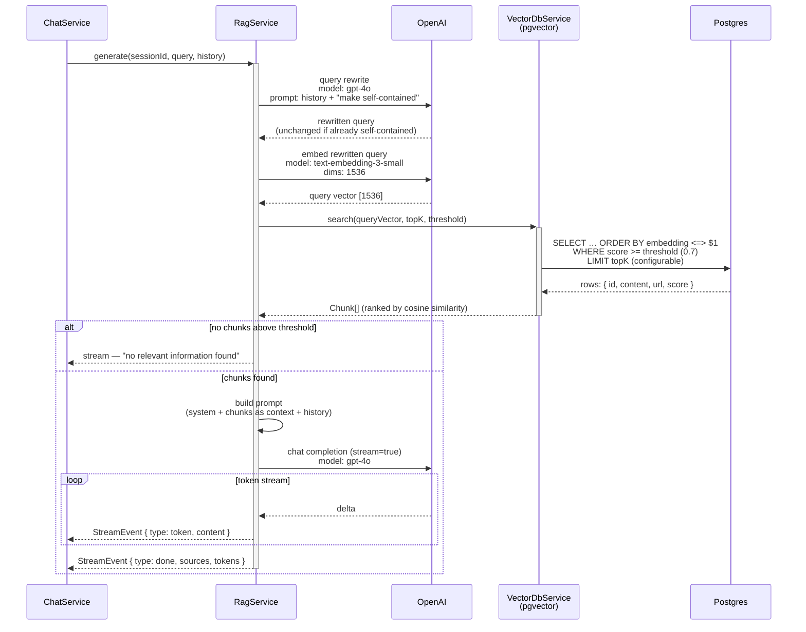
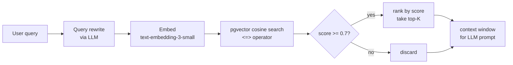

# Retrieval flow

> Source: projects/api/src/modules/rag/, docs/adr/009-rag-pipeline.md | Type: sequenceDiagram | Date: 2026-06-02
> Edit online: paste the code block below into https://mermaid.live

## RAG retrieval pipeline — from raw user query to ranked context chunks

## Chunk scoring detail

## Notes

- **Cosine distance** (`<=>`) is computed entirely in Postgres via the pgvector extension. Raw SQL is used for vector operations; Drizzle query builder handles everything else.
- **Threshold 0.7** is the production default (`RAG_SIMILARITY_THRESHOLD`). A lower value (e.g. 0.5) was used in earlier ADR drafts.
- **Top-K** is configurable via `RAG_TOP_K`; default is 3.
- **Query rewrite** prevents follow-up questions (e.g. "what about side effects?") from failing retrieval due to missing context. If the rewritten query is identical to the original, no extra latency is added.
- For the tool-call (contact collection) loop, see `projects/api/src/modules/rag/services/tool-handler.service.ts`.
