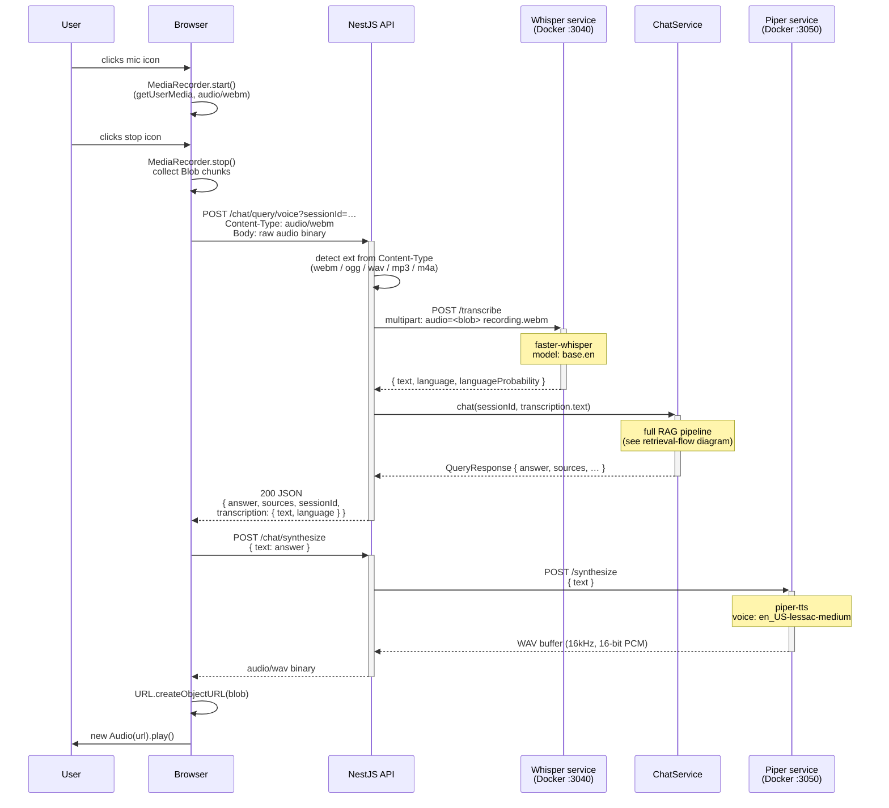
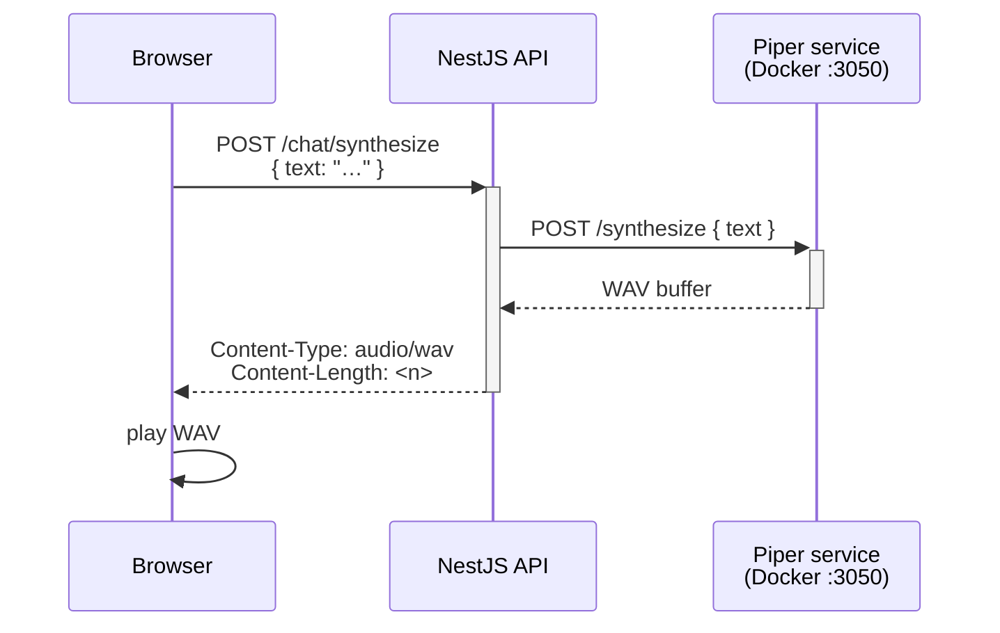
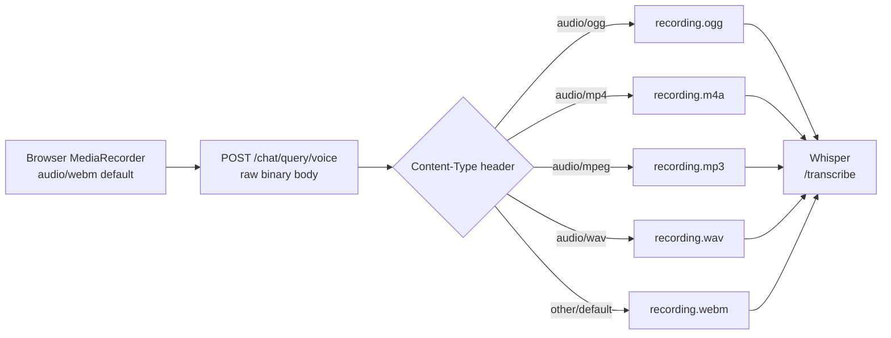

# Voice pipeline

> Source: projects/api/src/modules/chat/chat.controller.ts, whisper/, piper/, docs/VOICE_PIPELINE.md | Type: sequenceDiagram | Date: 2026-06-02
> Edit online: paste the code block below into https://mermaid.live

## Full voice query — microphone to spoken answer

## TTS-only path (`POST /chat/synthesize`)

## Audio format routing

## Notes

- **No multipart on the API** — audio is sent as a raw binary body to avoid `@fastify/multipart`; `sessionId` travels as a query param.
- **Whisper** receives a FormData blob; the filename extension tells it the container format. Model `base.en` gives ~1–3 s latency for typical questions.
- **Piper** responds synchronously with a full WAV buffer (~0.5–1 s). Streaming TTS is a noted future enhancement.
- **Voice query is non-streaming** — the chat answer is buffered so it can be returned alongside the transcription in one JSON response, then synthesized in a separate request.
- Both voice services require HTTPS or localhost due to browser `getUserMedia` restrictions.
